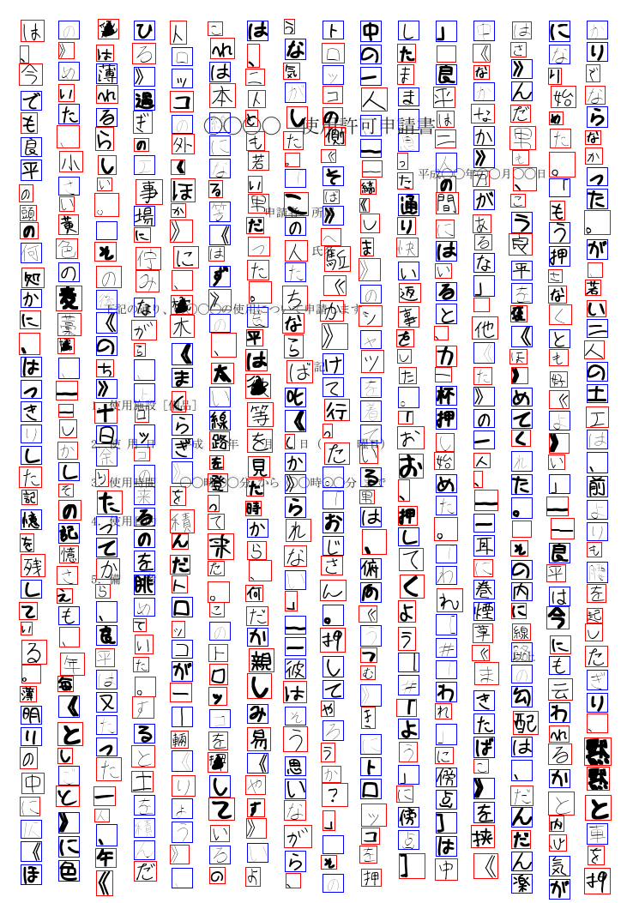

```py
from PIL import ImageDraw
from glob import glob
from random_char_image import TextRepo, BackgrandRepo, RandomImage

br = BackgrandRepo().with_file("templates/shiyoukyokashinnseisho09.jpg")
text = TextRepo().with_file("texts/hvt.txt")

ri = (
    RandomImage()
    .with_config(fontsize=24, line_space=20, char_space=20, direction="column")
    .with_backgrand(br.get())
    .with_text(text)
)
for i, p in enumerate(glob("fonts/*.ttf")):
    if i % 2 == 0:
        ri.with_label_font(p, label=0, is_random=True)
    else:
        ri.with_label_font(p, label=1, is_random=False)

img, boxes, labels = ri.get()
draw = ImageDraw.Draw(img)
for box, label in zip(boxes, labels):
    if label == 0:
        draw.rectangle(box, outline="red")
    else:
        draw.rectangle(box, outline="blue")
img.save("test.png")
```


